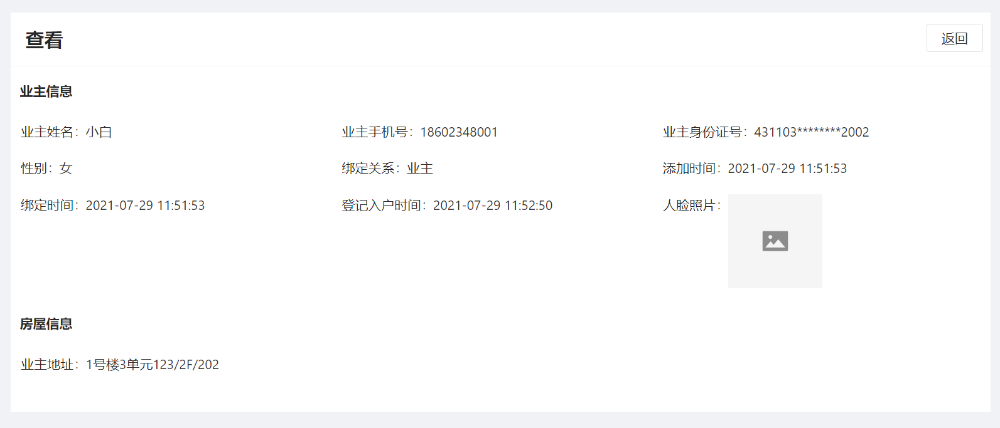

# ns-view-detail


## 示例详情页
<br/>



<br/>

## 结构参考

```ts
<template>
  <div> <ns-view-detail api=" " :detail="detail" /></div>
</template>
<script>
  import { defineComponent } from 'vue';
  export default defineComponent({
    setup() {
      //   配置详情列表;
      const detail = [
        {
          title: '',
          items: [
            {
              label: '',
              name: '',
              format: (value, data) => {
                switch (value) {
                  case 1:
                    return '';
                  ...
                  default:
                    return '';
                }
              },
            },
            ...
          ]
        },
        ...
      ];
      return { detail };
    },
  });
</script>
```
## 配置
<br/>

|  参数   |  说明 | 类型  |
|  :-: | :-:  | :-:  |
| title  | 详情页标题 | string |
| items  | detail配置项 | object |


**items配置项如下**
|  参数   |  说明 | 类型  |
|  :-: | :-:  | :-:  |
| label  | 详情label | string |
| name  | 对应字段名称 | string |
| value  | 数值 | string |
| format  | 数据格式化 | Function |
| type  | 类型 | string |


