# ns-view-add-form

## 示例Form
<br/>

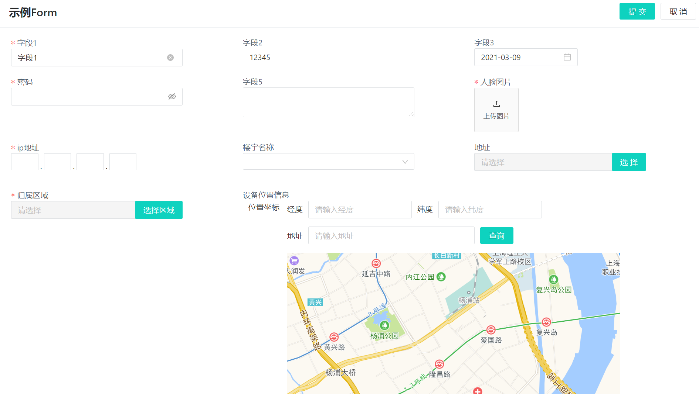

## 结构参考
```ts
<template>
  <div>
    <ns-view-add-form :schemas="formSchema" title=""  api="" />
  </div>
</template>
<script lang="ts">
 import { defineComponent } from 'vue';
 export default defineComponent({
     setup(){
        let formSchema = reactive([
            {
                field: '',
                label: '',
                component: '',
                rules: [],
                defaultValue:'', 
                componentProps:{},
                valueField:''
                changeEvent:[]
            },
            ...
        ]);
         return{
            formSchema
         }
     }
 });
</script>
```
## 配置

|  参数   |  说明  |  类型  |
|  :-: | :-:  | :-:  |
| schemas  | 表单内容项配置 | object |
| title  | 标题 | String |
| api  | 接口 | String |

- **schemas配置见下表**:

|   参数   |  说明  |  类型  |
|  :-: | :-:  | :-:  |
| field  | 字段Name | string |
| label  | 标签 | string |
| changeEvent  | 触发验证事件, 默认change 也可rule里定义 | string |
| valueField  | 绑定到 v-model 默认值的变量名 | string |
| component  | 组件 | string |
| rules  | 表单验证规则	 | object |
| defaultValue  | 默认值 | string |
| componentProps  | 组件传入的参数 | object |


## 表单域组件

<div class='formDemo'>

### NsInput

<div class='nsDemo'>

#### 代码演示

<br/>

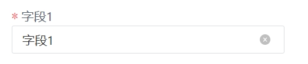

```ts
{
    field: 'field1',
    label: '字段1',
    component: 'NsInput',
    defaultValue:'字段1',
    rules: [
        {
            required: true,
            message: '请输入 字段1',
            trigger: 'change',
        },
    ],
},
```

**标准输入框**
</div>
</div>

<!-- ### NsGroup
### NsSearch -->

<div class='formDemo'>

### NsInputText

<div class='nsDemo'>

#### 代码演示

<br/>

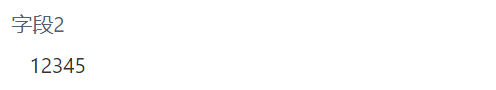

```ts
{
    field: 'field2', //不显示边框
    label: '字段2',
    component: 'NsInputText',
    defaultValue: 12345,
},
```
**不显示边框，只可查看的输入框**
</div>
</div>

<div class='formDemo'>

### NsDatePicker

<div class='nsDemo'>

#### 代码演示

<br/>

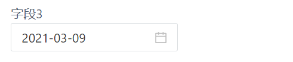

```ts
{
    field: 'field3',
    component: 'NsDatePicker',
    label: '字段3',
    defaultValue: 1615239337111,
},
```
**日期选择**
</div>
</div>

<div class='formDemo'>

### NsPassword

<div class='nsDemo'>

#### 代码演示

<br/>

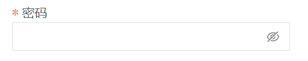

```ts
{
    field: 'passWord',
    label: '密码',
    component: 'NsInputPassword',
    rules: [
        {
            required: true,
            message: '请输入 密码',
            trigger: 'change',
        },
    ],
},
```
**密码框**
</div>
</div>

<div class='formDemo'>

### NsTextArea

<div class='nsDemo'>

#### 代码演示

<br/>

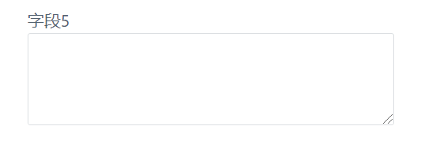

```ts
{
    field: 'field5',
    label: '字段5',
    component: 'NsTextarea',
    rules: [
        {
        required: false,
        message: '请输入 字段5',
        trigger: 'change',
        },
    ],
},
```
**文本框**
</div>
</div>

<div class='formDemo'>

### NsUpload

<div class='nsDemo'>

#### 代码演示

<br/>

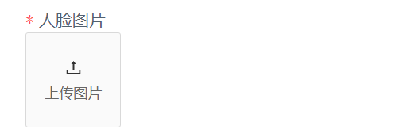

```ts
{
    field: 'field6',
    component: 'NsUpload',
    label: '人脸图片',
    componentProps: {
        // 上传的地址
        url: '/api/community/community/objs/FileUpload',
        // 上传的图片大小
        maxSize: 5242880,
        // 上传的图片类型
        fileType: ['jpg', 'png', 'jpeg'],
        // 展示图片数量
        count: 1,
        // 上传的文件类型，0-证书，1-图片，2-身份证件
        uploadType: 1,
    },
    rules: [
        {
            required: true,
            message: '请上传图片',
        },
    ],
},
```
**上传图片**
</div>
</div>

<div class='formDemo'>

### NsInputIp

<div class='nsDemo'>

#### 代码演示

<br/>

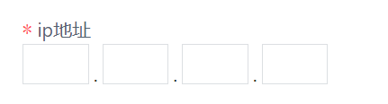

```ts
{
    field: 'ip',
    component: 'NsInputIp',
    label: 'ip地址',
    rules: [
        {
            required: true,
            // IP地址自定义校验规则
            validator: async (rule, value) => {
            if (!value) {
                return Promise.reject('主机IP地址不能为空');
            }
            if (
                !/^((2[0-4]\d|25[0-5]|[01]?\d\d?)\.){3}(2[0-4]\d|25[0-5]|[01]?\d\d?)$/.test(value)
            ) {
                return Promise.reject('请输入正确的ip地址');
            }
            },
            trigger: 'change',
        },
    ],
},
```
**输入ip地址**
</div></div>

<div class='formDemo'>

### nsSelectApi

<div class='nsDemo'>

#### 代码演示

<br/>

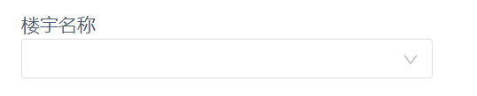

```ts
{
    field: 'fatherRegionUuid',
    label: '楼宇名称',
    component: 'nsSelectApi',
    defaultValue: '',
    componentProps: {
    api: '/api/community/community/objs/Region',
    params: {
        regionType: 2,
        pageSize: 200,
    },
    resultField: 'data.data',
    labelField: 'regionName',
    valueField: 'regionUuid',
    immediate: true,
    onChange: (value, option) => {
            //与楼层联动
            regionUuidRef.value = {
                regionUuid: value,
                regionType: option.regionType,
                pageSize: 20,
            };
        },
    },
},
{
    field: 'regionUuid',
    label: '楼层',
    defaultValue: '',
    component: 'nsSelectApi',
    componentProps: {
        api: '/api/community/community/objs/Region',
        params: regionUuidRef, //依赖
        resultField: 'data.data',
        labelField: 'regionName',
        valueField: 'regionUuid',
    },
},
```
**接收接口数据的下拉搜索框，并且可与其他搜索框联动**
</div></div>

<div class='formDemo'>

### NsInputAddress

<div class='nsDemo'>

#### 代码演示

<br/>

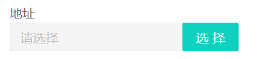

```ts
{
    field: 'personRoomRelationList',
    component: 'nsInputAddress',
    label: '地址',
    componentProps:{
        addonAfter: '选择',
    }
},
```
</div></div>

<div class='formDemo'>

### NsInputArea


<div class='nsDemo'>

#### 代码演示

<br/>

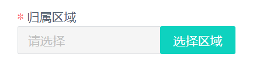

```ts
{
    field: 'regionUuid',
    component: 'NsInputArea',
    label: '归属区域',
    componentProps:{
        addonAfter:'选择区域',
    },
    rules: [
        {
            required: true,
            message: '请选择区域',
        },
    ],
},
```
</div></div>

<div class='formDemo'>

### NsMap

<div class='nsDemo'>

#### 代码演示

<br/>

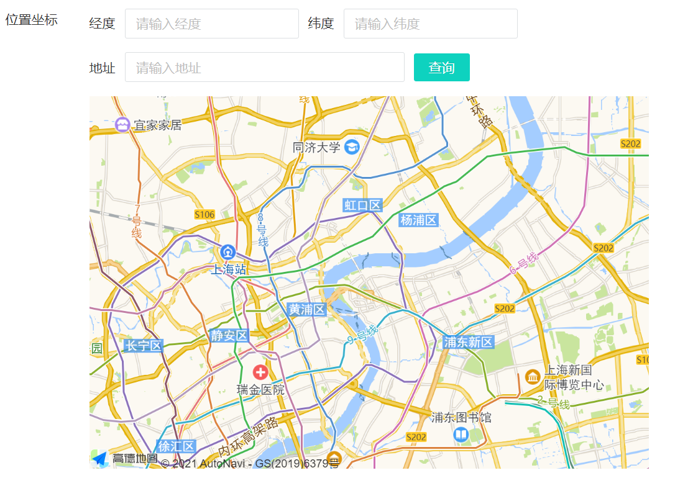

```ts
{
    field: 'remark',
    label: '设备位置信息',
    component: 'NsMap',
},
```
**地图-选择经纬度、位置**

</div></div>

<div class='formDemo'>

### NsUploadModal

<div class='nsDemo'>

#### 代码演示

<br/>

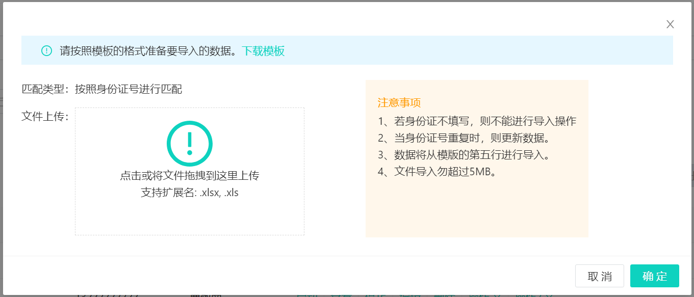

```ts
{
    field: 'field',
    component: 'NsUploadModal',
    componentProps: {
        // 上传的地址
        url: '/api/community/community/objs/Owner/Import',
        // 上传的文件大小,单位为字节
        maxSize: 5242880,
        // 下载地址
        downloadUrl: 'public/file/ownerImport.xls',
        // Excel文件名称
        excelName: '防区信息导入模版.xls',
        // 接口参数名称
        uploadFileName: 'file',
    },
},
```
**批量导入按钮**

</div></div>

## 特殊使用


