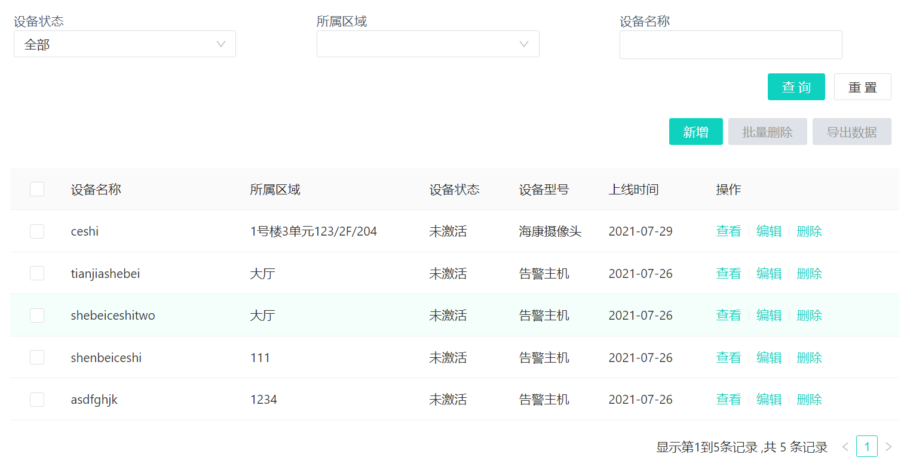
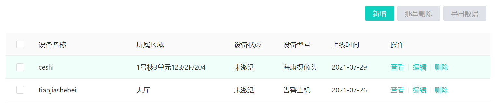
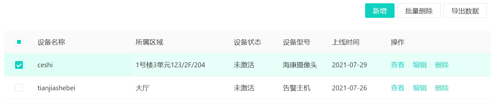

# ns-view-list-table

## 示例Table
<br/>



## 结构参考

```ts
<template>
  <div>
     <ns-view-list-table v-bind="tableConfig" />
  </div>
</template>
<script lang="ts">
 import { defineComponent } from 'vue';
 export default defineComponent({
     setup(){
        const tableConfig = {
            api: '',
            columns: [
                {
                    title: '',
                    dataIndex: '',
                    fixed: '',
                    width: 200,
                    ...
                },
                ...
            ],
            columnActions: {
                width: 250,
                title: '操作',
                actions: [
                    {
                        label: '',
                        name: '',
                        params: '' || [''] || {},
                        defaultParams: {  }, //默认参数
                        confirm: Boolean,
                        api: '',
                        route: '',
                        ...
                    },
                    ...
                ],
            },
            headerActions: [
                {
                    label: '',
                    name: '',
                    type: '',
                    params: '' || [''] || {},
                    route: '',
                    defaultParams: {  },
                    confirm: Boolean,
                    api: '',
                    handle,
                    ...
                },
                ...
            ],
            formConfig: {
                schemas: [
                    {
                        field: '',
                        label: '',
                        component: '',
                        rules: [],
                        defaultValue:'', 
                        componentProps:{},
                        valueField:''
                        changeEvent:[],
                        ...
                    },
                    ...
                ],
                params: {},
            },
            rowKey: '',
        };
         return{
            tableConfig
         }
     }
 });
</script>
```
## 配置

|  参数   |  说明  |  类型  |
|  :-: | :-:  | :-:  |
| tableConfig  | 表格内容项配置 | object |

|   参数   |  说明 | 类型  |
|  :-: | :-:  | :-:  |
| api  | table默认加载/搜索的接口 | String |
| columns  |  表格列的配置描述，具体项见下表[columns'Table](#columns'Table) | array |
| columnActions  | 表格行数据操作的配置描述，具体项见下表[columnActions'Table](#columnActions'Table)| Object |
| headerActions  | 表格操作配置描述 具体配置项与columnActions中的[action](#actions'Table)相同 | array |
| formConfig  | 搜索项配置描述 具体项见下表[formConfigs'Table](#formConfigs'Table) | array |
| rowKey  | 表格Key | String |

<div id="columns'Table"></div>

- **columns'Table**

|   参数   |  说明  |  类型  |
|  :-: | :-:  | :-:  |
| title  | 列头显示文字 | String |
| dataIndex  | 列数据在数据项中对应的 key | string |
| fixed  | 设置列内容的对齐方式 | 'left' / 'right' / 'center' 默认值：'left' |
| width  | 列宽度 | Number |

<div id="columnActions'Table"></div>

- **columnActions'Table**

|   参数  |  说明  | 类型  |
|  :-: | :-:  | :-:  |
| width  | 操作列宽度 | Number |
| title  | 操作列显示文字 | string |
| actions  | 操作列配置，具体项见下表actions'Table  | array |

<div id="actions'Table"></div>

- **actions'Table**

|   参数   |  说明  |  类型  |
|  :-: | :-:  | :-:  |
| label  | 操作中文名 | string |
| name  | 操作英文名 | string |
| route  | 配置了路由则直接跳转  | string |
| confirm  | 先弹窗再操作, true则使用默认显示方案 | boolean \| Confirm |
| api  | 自动请求api | string |
| params  | api传参 \|\| url传参  | string \| Array\<string\> \| object |
| defaultParams  | 默认参数 固定值 | object |
| handle  | 自定义回调，路由模式不触发 |  Function |
| ifShow  | 显示依赖  | boolean| Function |
| type  | 按钮  | String ---primary \| ghost \| dashed \| link \| text \| default |
| dynamicDisabled  | 是否禁用 | boolean \| Function |

<div id="formConfigs'Table"></div>

- **formConfigs'Table**

|  参数  |  说明  |  类型  |
|  :-: | :-:  | :-:  |
| schemas  | form表单配置项 可参考ns-view-add-form中的schemas配置 | array |
| params  | 参数 | object |


<!-- ## columnActions操作功能
<br/>

- **查看详情页**
<br/>


**结构参考**

```ts
<template>
  <div> <ns-view-detail api=" " :detail="detail" /></div>
</template>
<script>
  import { defineComponent } from 'vue';
  export default defineComponent({
    setup() {
      //   配置详情列表;
      const detail = [
        {
          title: '',
          items: [
            {
              label: '',
              name: '',
              format: (value, data) => {
                switch (value) {
                  case 1:
                    return '';
                  ...
                  default:
                    return '';
                }
              },
            },
            ...
          ]
        },
        ...
      ];
      return { detail };
    },
  });
</script>
```
**items配置项如下**

|  参数   |  说明 | 类型  |
|  :-: | :-:  | :-:  |
| label  | 详情label | string |
| name  | 对应字段名称 | string |
| value  | 数值 | string |
| format  | 数据格式化 | Function |
| type  | 类型 | string | -->


## headerActions操作功能
<br/>



<br/>



- **导出**

```ts
{
    label: '导出数据',
    name: 'exports',
    params: {},
    handle,
},
```

- **批量删除**

```ts
{
    label: '批量删除',
    name: 'deletes',
    defaultParams: { type: 1 },
    confirm: true,
    api: '',
    handle,
},
```

 <font  color=red>注意：导出和批量删除按name匹配，所以name固定配置为exports | deletes</font>

## 特殊使用

